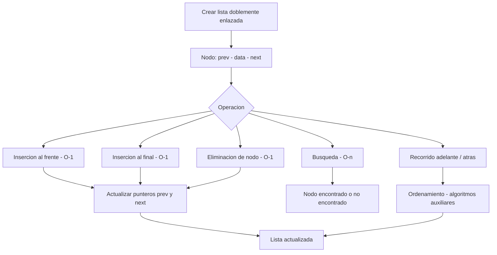

# 📌 Estructuras de Datos - Implementación de Listas Doblemente Enlazadas  

## 📖 Descripción

---

Este proyecto implementa estructuras de datos avanzadas, centrándose en listas doblemente enlazadas para manipulación eficiente de datos.

## 🛠️ Funcionalidades  
- Inserción y eliminación de nodos en tiempo constante.  
- Búsqueda y recorrido de la lista en ambas direcciones.  
- Implementación de métodos auxiliares para ordenamiento.  
- Aplicación en algoritmos de búsqueda y almacenamiento dinámico.  

## 🚀 Tecnologías utilizadas  
- C++ / Java / Python  
- Algoritmos y estructuras de datos  

## ▶️ Cómo ejecutar el proyecto  
1. Compilar y ejecutar el código fuente en el lenguaje correspondiente.  
2. Probar las operaciones de inserción, eliminación y búsqueda.  
3. Evaluar el rendimiento en comparación con otras estructuras.  

## 📌 Autor  
👨‍💻 **Alejandro De Mendoza**

---

## Arquitectura

## Autor

**Alejandro De Mendoza**  
Ingeniero Informático · Especialista en IA · Especialista en Ingeniería de Software · Máster en Arquitectura de Software

